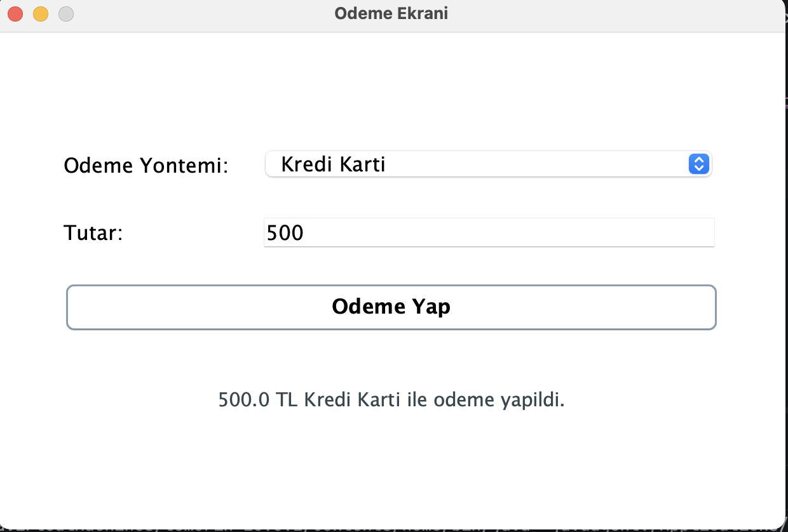
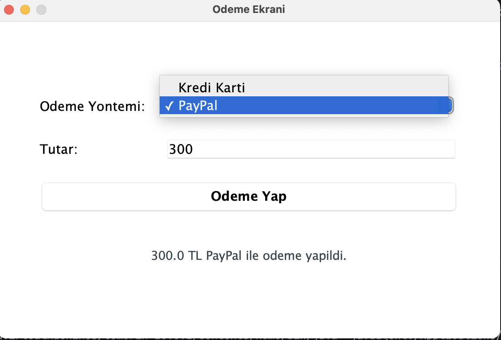

# Payment Management

Bu proje, Java Swing ile hazirlanmis basit bir odeme ekrani uygulamasidir.
Kullanici odeme yontemini secer, tutari girer ve "Odeme Yap" butonuna basarak sonucu ekranda gorur.

## Yapi

- `PaymentMethod` tum odeme yontemleri icin ortak arayuzdur.
- `CreditCardPayment` mevcut odeme yontemidir.
- `PayPalPayment` yeni eklenen odeme yontemidir.
- `PaymentService` odeme islemini baslatir.
- `PaymentFrame` Swing arayuzunu yonetir.
- `Main` uygulamayi baslatir.

## SOLID

- `Open/Closed Principle`: Yeni odeme yontemi icin sadece `PaymentMethod` implemente eden yeni bir sinif eklenir.
- `Single Responsibility Principle`: Her sinif tek bir goreve odaklanir.

## Calistirma

```bash
javac -d out src/*.java
java -cp out Main
```

## Ornek Akis

1. Kullanici odeme yontemini acilir listeden secer.
2. Kullanici tutari metin alanina girer.
3. "Odeme Yap" butonuna basilir.
4. Sistem odemeyi yapip sonucu pencere uzerinde gosterir.



